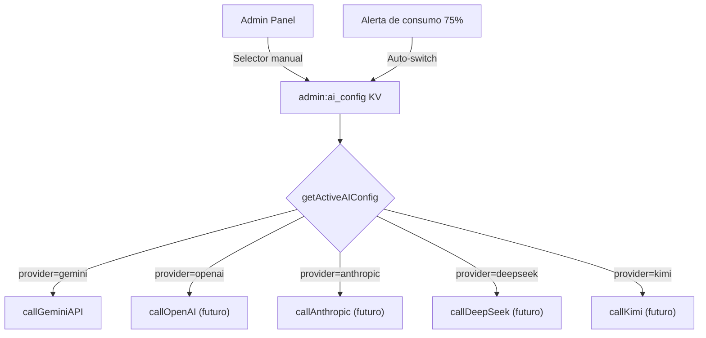

# Análisis: Multi-LLM & JSON vs SSE para AI Studio

## 1. Comparativa de Modelos LLM para Generación SCAD

La tarea principal del Motor IA es **generar código OpenSCAD válido** a partir de prompts en lenguaje natural. Esto requiere:
- ✅ Razonamiento espacial 3D
- ✅ Conocimiento de sintaxis OpenSCAD
- ✅ Adherencia estricta a formato JSON
- ✅ Comprensión de restricciones paramétricas (FDM, tolerancias, etc.)

### Ranking por Efectividad para SCAD

| # | Proveedor | Modelo | Calidad SCAD | Costo /1K tokens | Latencia | JSON Structured | Ideal Para |
|---|-----------|--------|:------------:|:---------:|:--------:|:---------------:|------------|
| 🥇 | **Google** | `gemini-2.5-pro` | ⭐⭐⭐⭐⭐ | $0.00125 | ~5-8s | ✅ Nativo | **Producción principal** |
| 🥈 | **Anthropic** | `claude-sonnet-4` | ⭐⭐⭐⭐⭐ | $0.003 | ~5-10s | ✅ Bueno | Complejidad alta, auditoría |
| 🥉 | **Google** | `gemini-2.5-flash` | ⭐⭐⭐⭐ | $0.00015 | ~2-3s | ✅ Nativo | **Fallback económico / iteraciones** |
| 4 | **DeepSeek** | `deepseek-coder-v2` | ⭐⭐⭐⭐ | $0.00014 | ~3-5s | ⚠️ Parcial | **Alternativa ultra-económica** |
| 5 | **OpenAI** | `gpt-4o` | ⭐⭐⭐⭐ | $0.005 | ~5-10s | ✅ Bueno | Backup premium |
| 6 | **OpenAI** | `gpt-4o-mini` | ⭐⭐⭐ | $0.00015 | ~2-3s | ✅ Bueno | Iteraciones económicas |
| 7 | **Moonshot** | `kimi-k2` | ⭐⭐⭐ | $0.0002 | ~4-8s | ⚠️ Parcial | Experimental |
| 8 | **Anthropic** | `claude-haiku-3` | ⭐⭐⭐ | $0.00025 | ~2-3s | ✅ Bueno | Iteraciones rápidas |

> [!NOTE]
> **¿Por qué Gemini Pro es #1?** Combina el mejor soporte nativo de JSON estructurado (`responseMimeType: "application/json"`), excelente razonamiento espacial, y un costo 4x menor que GPT-4o. Además ya lo tenemos integrado con API key activa.

> [!TIP]
> **Estrategia recomendada para producción:**
> - **Default**: `gemini-2.5-pro` — Mejor relación calidad/costo para SCAD
> - **Auto-fallback por consumo**: Si el budget supera el 75%, cambiar a `gemini-2.5-flash`
> - **Fallback por rate-limit**: Si Gemini devuelve 429, intentar DeepSeek o GPT-4o-mini
> - **BYOK (Bring Your Own Key)**: Usuarios PRO/STUDIO pueden usar su propia API key

### Estimación de Costos Mensuales

| Escenario | Modelo | Generaciones/mes | Costo estimado |
|-----------|--------|:----------------:|:--------------:|
| Beta (5 usuarios) | gemini-2.5-pro | ~100 | **~$0.50** |
| Launch (50 usuarios) | gemini-2.5-pro | ~1,000 | **~$5.00** |
| Growth (500 usuarios) | gemini-2.5-pro + flash fallback | ~10,000 | **~$30-50** |
| Scale (5000 usuarios) | Mix pro/flash/deepseek | ~100,000 | **~$150-300** |

---

## 2. Arquitectura Multi-LLM ya Implementada

Ya implementé en `ai-generation-engine.ts` la estructura `AIProviderConfig` que se almacena en KV como `admin:ai_config`. Esto permite:

### Qué ya está listo:
- ✅ `AIProviderConfig` con 5 proveedores y sus modelos
- ✅ `getActiveAIConfig()` resuelve provider/model/apiKey dinámicamente
- ✅ `getAIProviderConfig()` para el admin panel (incluye `_availableProviders` basado en env vars)
- ✅ Detección automática de providers disponibles por API keys en `.env`

### Próximo paso (Panel Admin):
- Selector de provider + modelo
- Toggle manual/automático
- Alertas visuales de consumo vs budget

---

## 3. JSON vs SSE (Streaming) — Análisis Costo-Beneficio

### JSON Completo (Implementación actual)

| Aspecto | Valoración |
|---------|:----------:|
| **Complejidad de implementación** | ⭐ Simple |
| **UX de espera** | 😐 Spinner 5-10s |
| **Parsing de respuesta** | ✅ Trivial |
| **Manejo de errores** | ✅ Simple (un solo try/catch) |
| **Refund de créditos on failure** | ✅ Limpio |
| **Carga de servidor** | ✅ Baja (una conexión, termina rápido) |
| **Consistencia de response** | ✅ Garantizada |

### SSE Streaming

| Aspecto | Valoración |
|---------|:----------:|
| **Complejidad de implementación** | ⭐⭐⭐ Media-Alta |
| **UX de espera** | 🤩 Texto progresivo (como ChatGPT) |
| **Parsing de respuesta** | ⚠️ Complejo (chunks parciales de JSON) |
| **Manejo de errores** | ⚠️ Difícil (error mid-stream) |
| **Refund de créditos on failure** | 🔴 Complejo (¿cuándo es "fallo"?) |
| **Carga de servidor** | ⚠️ Conexiones long-lived |
| **Consistencia de response** | ⚠️ Puede truncarse |

### Veredicto

> [!IMPORTANT]
> **Recomendación: JSON para Fase 1, SSE opcional en Fase 3.**
> 
> - En nuestro caso, el LLM genera **código SCAD completo** que no se puede ejecutar parcialmente. No tiene sentido mostrar el código "carácter por carácter" porque necesitamos el JSON completo para parsearlo y pasarlo al compilador.
> - La UX de espera se resuelve mejor con un **estado de loading con animación** (spinner con mensajes progresivos tipo "Analizando tu idea...", "Generando geometría...", "Validando SCAD...") que con streaming real.
> - SSE tiene sentido para **chat conversacional** (como el futuro iterate/refine), no para generación one-shot.

**Costo de agregar SSE después**: ~4h de trabajo (cambiar `generateContent` → `streamGenerateContent`, implementar EventSource en frontend, manejar reconexión). No es bloqueante para el futuro.

---

## Resumen de Decisiones

| Decisión | Elegido | Razón |
|----------|---------|-------|
| Modelo default | `gemini-2.5-pro` | Mejor calidad SCAD, ya integrado |
| Configurable desde admin | ✅ Implementado | `admin:ai_config` en KV |
| Multi-LLM futuro | ✅ Estructura lista | 5 providers definidos, env-key detection |
| Protocolo de respuesta | JSON (Fase 1) | SCAD no es streameable parcialmente |
| Rama git | `feature/ai-studio-llm-engine` | Sin prefijo codex/ |
