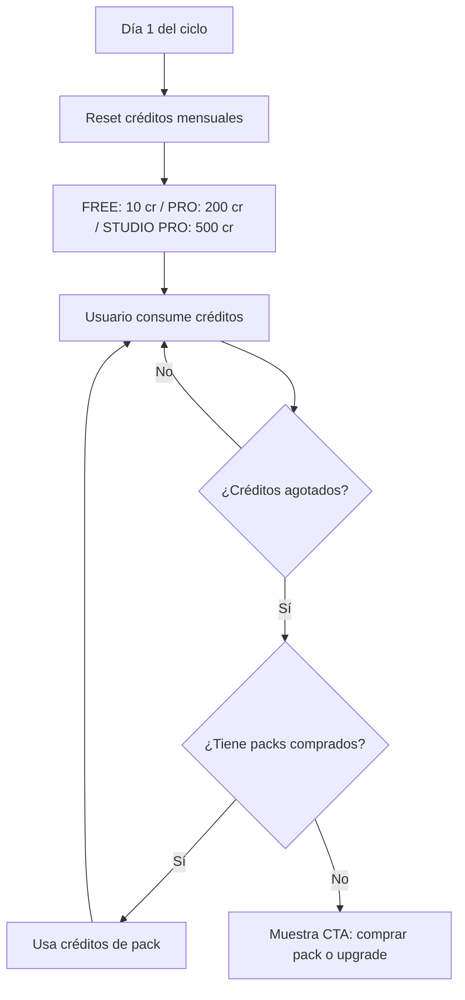

# Vorea Studio — Estrategia de Monetización v2 (Revisada)

**Autor**: Análisis CPO · Marzo 2026  
**Producto**: Vorea Parametrics 3D (voreastudio.com)  
**Owner**: Martín Darío Daguerre

---

## 1. Cambios Críticos respecto a v1

| # | Feedback del Owner | Acción tomada |
|---|-------------------|---------------|
| 1 | **Todos los valores deben ser editables desde Admin** | Diseño de schema `ToolCreditConfig` 100% admin-editable (Sección 3) |
| 2 | **IA: presupuesto global máximo $100/mes**, nunca superando ingresos | "AI Global Budget Cap" con circuit breaker automático (Sección 5) |
| 3 | **Créditos se resetean mensualmente** | Ciclo de billing mensual con reset automático (Sección 4) |
| 4 | **Pérdida de estado al recargar / navegar** | Spec de deep-link URL con query params en hash routing (Sección 7) |
| 5 | **No se puede compartir URL de un recurso** | Formato `#/studio?project=abc&mode=parametric` (Sección 7) |
| 6 | **Valor del crédito editable desde admin** | `creditValueUsd` como campo en [BusinessConfig](file:///e:/__Vorea-Studio/__3D_parametrics/Vorea-Paramentrics-3D/src/app/services/business-config.ts#36-43) |

---

## 2. Tabla Maestra de Créditos por Acción

> [!IMPORTANT]
> Cada celda de esta tabla es un campo editable en el panel de administración bajo **Admin → Créditos por Herramienta**. El admin puede cambiar cualquier valor sin tocar código.

### Unidad de crédito

**1 crédito ≈ $0.05 USD** (editable desde admin como `creditValueUsd`)

### 2.1 `#/studio` (+ `#/parametric` fusionado)

| Acción | Créditos | FREE/mes | PRO/mes | STUDIO PRO |
|--------|:--------:|:--------:|:-------:|:----------:|
| Abrir / editar parámetros | 0 | ∞ | ∞ | ∞ |
| Preview 3D tiempo real | 0 | ∞ | ∞ | ∞ |
| Copiar código SCAD | 0 | ∞ | ∞ | ∞ |
| Descargar STL | 1 | 5 | ∞ | ∞ |
| Descargar OBJ | 2 | — | ∞ | ∞ |
| Descargar 3MF | 2 | — | ∞ | ∞ |
| Descargar SCAD editable | 3 | — | — | ∞ |
| Publicar en comunidad | 0 | 3 | ∞ | ∞ |
| Guardar proyecto (nube) | 0 | 3 proy. | ∞ | ∞ |

### 2.2 `#/comunidad`

| Acción | Créditos | FREE/mes | PRO/mes | STUDIO PRO |
|--------|:--------:|:--------:|:-------:|:----------:|
| Navegar / explorar | 0 | ∞ | ∞ | ∞ |
| Like / seguir | 0 | ∞ | ∞ | ∞ |
| Comentar | 0 | 5/día | ∞ | ∞ |
| Fork un modelo | 1 | 3 | ∞ | ∞ |
| Publicar modelo | 0 | 3 | ∞ | ∞ |
| Descargar modelo ajeno | 1 | 2 | ∞ | ∞ |

### 2.3 `#/relief` ⭐

| Acción | Créditos | FREE/mes | PRO/mes | STUDIO PRO |
|--------|:--------:|:--------:|:-------:|:----------:|
| Abrir herramienta | 0 | ✅ | ✅ | ✅ |
| Cargar imagen (≤2 MB) | 0 | 3/día | ∞ | ∞ |
| Cargar imagen (2–10 MB) | 1 | — | 10/día | ∞ |
| Cargar imagen (>10 MB) | 2 | — | — | 5/día |
| Crear forma manual | 0 | ∞ | ∞ | ∞ |
| Exportar STL simple | 1 | 3 | ∞ | ∞ |
| Exportar 3MF (color zones) | 3 | — | 10 | ∞ |
| Exportar Hybrid/Bambu | 3 | — | 10 | ∞ |
| Guardar proyecto | 0 | 2 proy. | ∞ | ∞ |
| [Futuro] Carga SVG | 1 | — | ✅ | ✅ |
| [Futuro] Carga STL mapeo | 2 | — | — | ✅ |

**Límites de resize (admin-editables):**

| Tier | Peso máx. | Resize automático a | Admin field |
|------|:---------:|:-------------------:|-------------|
| FREE | 2 MB | 1024px | `imageLimits.free.maxBytes`, `imageLimits.free.resizePx` |
| PRO | 10 MB | 2048px | `imageLimits.pro.maxBytes`, `imageLimits.pro.resizePx` |
| STUDIO PRO | 25 MB | Sin resize | `imageLimits.studioPro.maxBytes` |

### 2.4 `#/organic`

| Acción | Créditos | FREE | PRO/mes | STUDIO PRO |
|--------|:--------:|:----:|:-------:|:----------:|
| Visualizar demo | 0 | ✅ | ✅ | ✅ |
| Aplicar deformación | 1 | — | ∞ | ∞ |
| Exportar mesh deformado | 2 | — | 10 | ∞ |
| [Futuro] Deformar SCAD/malla | 3 | — | 5 | ∞ |

### 2.5 `#/gcode-collection`

| Acción | Créditos | FREE | PRO/mes | STUDIO PRO |
|--------|:--------:|:----:|:-------:|:----------:|
| Visualizar GCode | 0 | ✅ | ✅ | ✅ |
| Edición lineal básica | 1 | 6 totales | ∞ | ∞ |
| Edición no-lineal (FullControl) | 3 | — | 10 | ∞ |
| Deformación en vivo | 3 | — | 5 | ∞ |
| Exportar GCode | 1 | usa gratis | ∞ | ∞ |

### 2.6 `#/ai-studio` 🤖

| Acción | Créditos | FREE/mes | PRO/mes | STUDIO PRO |
|--------|:--------:|:--------:|:-------:|:----------:|
| Text-to-3D simple | 5 | 1/día | 20/día | ∞ |
| Text-to-3D complejo | 10 | — | 10/día | ∞ |
| Generar SCAD vía agente | 8 | — | 10/día | ∞ |
| Generar F3D vía agente | 10 | — | 5/día | ∞ |
| Iteración/refinamiento | 3 | cuenta como nueva | igual | igual |
| BYOK (key propia) | 0 | — | — | ✅ |

### 2.7 `#/makerworld`

| Acción | Créditos | FREE | PRO/mes | STUDIO PRO |
|--------|:--------:|:----:|:-------:|:----------:|
| Navegar catálogo | 0 | ✅ | ✅ | ✅ |
| Cargar SCAD | 2 | — | 5 | ∞ |
| Publicar en MakerWorld | 3 | — | ✅ | ✅ |
| Descargar preparado | 1 | — | ✅ | ✅ |

### 2.8 Feedback

| Acción | Créditos | Recompensa |
|--------|:--------:|:----------:|
| Enviar reporte | 0 | — |
| Bug válido | — | **+3 a +10** |
| Sugerencia implementada | — | **+5 a +15** |
| Bug crítico | — | **+20 a +50** |

---

## 3. Schema Admin-Editable: `ToolCreditConfig`

Toda la tabla anterior se almacena como un documento **editable desde Admin → Créditos** en la base de datos:

```typescript
interface ToolCreditConfig {
  // Global
  creditValueUsd: number;                    // Default: 0.05
  monthlyCredits: Record<MembershipTier, number>; // { FREE: 10, PRO: 200, "STUDIO PRO": 500 }

  // Per-tool config (each tool is a key)
  tools: Record<ToolId, ToolConfig>;
}

interface ToolConfig {
  actions: ActionConfig[];   // Array of per-action configs
}

interface ActionConfig {
  actionId: string;          // e.g. "download_stl"
  labelKey: string;          // i18n key for display
  creditCost: number;        // Editable credit cost
  limits: {
    free: number | null;     // null = blocked, -1 = unlimited
    pro: number | null;
    studioPro: number | null;
  };
  limitPeriod: "day" | "month" | "total" | "unlimited";
}

// AI-specific additions
interface AIBudgetConfig {
  globalMonthlyBudgetUsd: number;   // Default: 100 (HARD CAP)
  maxBudgetPercentOfRevenue: number; // Default: 100 (never > monthly plan revenue)
  currentMonthSpentUsd: number;      // Live counter
  perTierDailyLimits: Record<MembershipTier, number>; // Hard daily limits
  circuitBreakerEnabled: boolean;    // Auto-disable when budget exhausted
}

// Image limits
interface ImageLimitsConfig {
  free:      { maxBytes: number; resizePx: number };
  pro:       { maxBytes: number; resizePx: number };
  studioPro: { maxBytes: number; resizePx: number | null }; // null = no resize
}
```

> [!TIP]
> En el admin panel, esto se renderiza como una tabla editable con columnas: **Herramienta → Acción → Créditos → FREE → PRO → STUDIO PRO**, con inputs numéricos. El admin no necesita tocar código para cambiar ningún valor.

---

## 4. Ciclo Mensual de Créditos



**Reglas del reset mensual:**
- Los créditos mensuales del tier **no se acumulan** (use-it-or-lose-it)
- Los créditos de **packs comprados sí se acumulan** (nunca expiran)
- El reset se ejecuta server-side el día 1 del ciclo de billing

---

## 5. AI Global Budget Cap (Circuit Breaker) 🚨

> [!CAUTION]
> **Regla absoluta**: El gasto en APIs de IA nunca puede superar los ingresos mensuales. Si tenemos $80/mes en planes, el budget de IA es como máximo $80 (o el cap fijo de $100, el menor de los dos).

```typescript
// Pseudocódigo del circuit breaker
async function canMakeAIRequest(userId: string, tier: MembershipTier): Promise<boolean> {
  const config = await getAIBudgetConfig(); // Admin-editable
  const monthlyRevenue = await getMonthlyPlanRevenue();
  const effectiveBudget = Math.min(
    config.globalMonthlyBudgetUsd,
    monthlyRevenue * (config.maxBudgetPercentOfRevenue / 100)
  );

  if (config.currentMonthSpentUsd >= effectiveBudget) {
    return false; // ⛔ Circuit breaker: budget exhausted
  }

  const userDailyUsage = await getUserAIDailyCount(userId);
  const dailyLimit = config.perTierDailyLimits[tier];
  if (dailyLimit !== -1 && userDailyUsage >= dailyLimit) {
    return false; // ⛔ User daily limit reached
  }

  return true;
}
```

**Campos editables desde Admin → IA Budget:**

| Campo | Default | Descripción |
|-------|---------|-------------|
| `globalMonthlyBudgetUsd` | $100.00 | Cap absoluto mensual para todas las APIs |
| `maxBudgetPercentOfRevenue` | 100% | Nunca gastar más del X% de revenue mensual |
| `currentMonthSpentUsd` | (auto) | Contador en vivo (read-only en admin) |
| `perTierDailyLimits.FREE` | 1 | Requests/día para FREE |
| `perTierDailyLimits.PRO` | 20 | Requests/día para PRO |
| `perTierDailyLimits.STUDIO_PRO` | -1 | -1 = sin límite diario (sujeto al budget global) |

---

## 6. Packs de Créditos Universales (admin-editables)

| Pack | Créditos | Precio USD | $/crédito | Bonus | Admin ID |
|------|:--------:|:----------:|:---------:|:-----:|----------|
| Starter | 20 | $1.99 | $0.100 | — | `pack_starter` |
| Maker | 60 | $4.99 | $0.083 | — | `pack_maker` |
| Creator | 150 | $9.99 | $0.067 | +10 | `pack_creator` |
| Studio | 500 | $24.99 | $0.050 | +50 | `pack_studio` |
| Enterprise | 2000 | $79.99 | $0.040 | +200 | `pack_enterprise` |

> Los packs se administran en **Admin → Planes → Credit Packs** (ya existente, extender a universal).

---

## 7. URL State Management (Deep Links) 🔗

> [!WARNING]
> **Problema actual:** [nav.tsx](file:///e:/__Vorea-Studio/__3D_parametrics/Vorea-Paramentrics-3D/src/app/nav.tsx) → [readHash()](file:///e:/__Vorea-Studio/__3D_parametrics/Vorea-Paramentrics-3D/src/app/nav.tsx#51-58) **strip query params** activamente (línea 56). El formato actual es solo `#/studio` sin posibilidad de parámetros. Esto causa:
> - Pérdida de contexto al recargar
> - Imposibilidad de compartir URLs
> - Imposibilidad de restaurar el estado exacto del editor

### Propuesta: Hash con Query Params

```
/#/studio?project=abc123&mode=parametric&tab=params
/#/relief?project=def456
/#/comunidad?user=xyz789&sort=popular
/#/modelo/abc123
```

### Cambios requeridos en [nav.tsx](file:///e:/__Vorea-Studio/__3D_parametrics/Vorea-Paramentrics-3D/src/app/nav.tsx)

```diff
- function readHash(): string {
-   const h = window.location.hash.replace(/^#/, "") || "/";
-   const qIdx = h.indexOf("?");
-   return qIdx >= 0 ? h.slice(0, qIdx) : h;
- }

+ function readHash(): { pathname: string; search: string } {
+   const h = window.location.hash.replace(/^#/, "") || "/";
+   const qIdx = h.indexOf("?");
+   return {
+     pathname: qIdx >= 0 ? h.slice(0, qIdx) : h,
+     search: qIdx >= 0 ? h.slice(qIdx) : "",
+   };
+ }
```

**Nuevo hook `useSearchParams()`:**

```typescript
export function useSearchParams(): [URLSearchParams, (params: Record<string, string>) => void] {
  const { search, navigate, pathname } = useContext(NavContext);
  const params = new URLSearchParams(search);
  const setParams = (newParams: Record<string, string>) => {
    const sp = new URLSearchParams(newParams);
    navigate(`${pathname}?${sp.toString()}`);
  };
  return [params, setParams];
}
```

### URLs ejemplo por herramienta

| Herramienta | URL Pattern |
|-------------|------------|
| Studio editando proyecto | `#/studio?project=abc123&mode=parametric` |
| Relief con proyecto | `#/relief?project=def456` |
| Modelo en comunidad | `#/modelo/abc123` |
| Perfil público | `#/user/xyz789` |
| GCode de un archivo | `#/gcode-collection?file=ghi789` |
| AI Studio con prompt | `#/ai-studio?session=jkl012` |

### State Persistence (complementario)

Además de los query params, guardar el estado del editor en `localStorage` con key `vorea_editor_state_{projectId}` para restaurar sliders, viewport, etc. al recargar.

---

## 8. Sistema de Recompensas "Vorea Rewards"

| Acción | XP | Créditos Bonus |
|--------|:--:|:--------------:|
| Completar onboarding | 50 | +5 |
| Primer modelo publicado | 100 | +10 |
| 10 likes en un modelo | 25 | +3 |
| 50 likes en un modelo | 100 | +10 |
| Racha 7 días | 50 | +5 |
| Racha 30 días | 200 | +20 |
| Bug válido reportado | 75 | +5 a +10 |
| Sugerencia implementada | 150 | +10 a +15 |
| Bug crítico | 500 | +20 a +50 |
| Invitar amigo (registra) | 100 | +10 |
| Amigo upgradeó a PRO | 300 | +30 |

**Niveles:** Novato (0 XP) → Maker (500) → Creator (2K) → Expert (5K) → Master (15K) → Legend (50K)

> Cada nivel otorga +5% bonus en compras de packs (acumulable).

---

## 9. Métricas por Herramienta

### Eventos universales

| Evento | Datos |
|--------|-------|
| `tool.session_start` | userId, tool, tier, timestamp, sessionId |
| `tool.session_end` | sessionId, duration_sec, actions_count |
| `tool.action` | sessionId, action_type, credits_consumed |
| `tool.export` | sessionId, format, file_size, credits |

### KPIs clave

| KPI | Fórmula | Meta |
|-----|---------|------|
| ARPU | Revenue / activos | > $3/mes |
| Credit Burn Rate | Consumidos / disponibles | 60-80% |
| Conversion FREE→PRO | Upgrades / FREE total | > 5% |
| AI Budget Utilization | AI spend / AI budget cap | < 90% |
| Churn PRO | Cancelaciones / total PRO | < 8% |

---

## 10. Fusión `#/parametric` → `#/studio`

**Confirmada.** Plan de ejecución:

1. Absorber como modo/tab: `#/studio?mode=parametric`
2. Redirect 301: `#/parametric` → `#/studio?mode=parametric`
3. Unificar métricas bajo `tool=studio`
4. Eliminar [Parametric.tsx](file:///e:/__Vorea-Studio/__3D_parametrics/Vorea-Paramentrics-3D/src/app/pages/Parametric.tsx) como página, mover lógica a [Editor.tsx](file:///e:/__Vorea-Studio/__3D_parametrics/Vorea-Paramentrics-3D/src/app/pages/Editor.tsx)

---

## 11. Roadmap Revisado

| Fase | Plazo | Entregables |
|------|-------|-------------|
| **1** URL State | 1 sem | Refactor [nav.tsx](file:///e:/__Vorea-Studio/__3D_parametrics/Vorea-Paramentrics-3D/src/app/nav.tsx), `useSearchParams()`, estado persistente |
| **2** Schema ToolCreditConfig | 1 sem | Modelo DB, API endpoints, migration |
| **3** Admin UI Créditos | 1-2 sem | Tab "Créditos" en SuperAdmin con tabla editable completa |
| **4** Créditos universales | 1 sem | Reemplazar GCode-only por sistema universal, reset mensual |
| **5** Fusión Parametric→Studio | 1-2 sem | Tabs, redirect, consolidación |
| **6** AI Budget Cap | 1 sem | Circuit breaker, dashboard de gasto live |
| **7** Rewards | 2-3 sem | Backend XP, badges, créditos bonus |
| **8** Telemetría | 2 sem | Event bus, dashboards |
