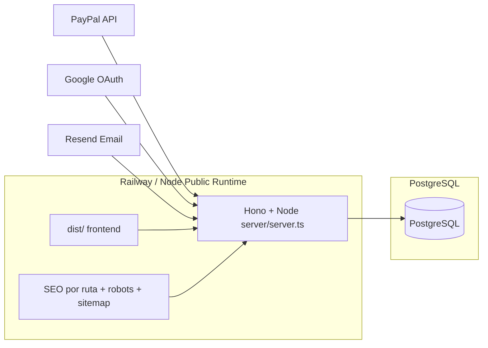
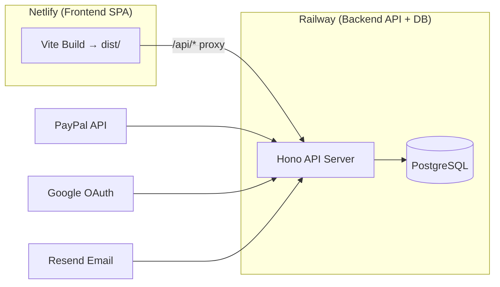

# 🚀 Vorea Studio — Guía de Deploy a Producción

> Propiedad de [Vorea Studio](https://voreastudio.com) — Martín Darío Daguerre

---

## Estado del Código ✅

Todo el código necesario ya está implementado y listo:

| Componente | Estado |
|---|---|
| Google OAuth Server Routes | ✅ Completo |
| Password Validation + indicador visual | ✅ Completo |
| Deploy configs ([.env.example](file:///e:/__Vorea-Studio/__3D_parametrics/Vorea-Paramentrics-3D/.env.example), [netlify.toml](file:///e:/__Vorea-Studio/__3D_parametrics/Vorea-Paramentrics-3D/netlify.toml), [Dockerfile](file:///e:/__Vorea-Studio/__3D_parametrics/Vorea-Paramentrics-3D/Dockerfile), [railway.json](file:///e:/__Vorea-Studio/__3D_parametrics/Vorea-Paramentrics-3D/railway.json)) | ✅ Completo |
| Password Reset con Resend email | ✅ Completo |
| PayPal Subscriptions + Credit Packs | ✅ Completo |
| CORS con dominios productivos | ✅ `voreastudio.com`, `voreastudio3d.com` ya configurados |
| SPA fallback + health check | ✅ Completo |
| Prisma schema completo | ✅ 18 modelos listos |

---

## Arquitectura de Deploy Recomendada



**Frontend público** → Node (`server/server.ts`)  
**API** → mismo runtime (`/api/*`)  
**DB** → PostgreSQL  

### Estado de decisión

Desde `2026-03-23`, la ruta recomendada para `BG-108` es:

1. `voreastudio3d.com` servido por Node;
2. Netlify queda como legado o contingencia, no como arquitectura objetivo.

Checklist operativa del corte:

- `docs/operations/railway-node-cutover-checklist.md`

Nota operativa:

- si desde la sesión actual no hay acceso a Railway dashboard o DNS, se permite un bridge temporal en Netlify que proxee `voreastudio3d.com` hacia el runtime Node publicado en `api.voreastudio3d.com`;
- ese bridge no cambia la arquitectura objetivo, solo permite ejecutar el corte visible mientras se completa el cutover final.

## Arquitectura Legacy / Transición



**Frontend** → Netlify (SPA estática, proxy `/api/*` al backend)
**Backend** → Railway (Docker, Hono + Node.js + Prisma + PostgreSQL)

> [!IMPORTANT]
> Estado 2026-03-22: esta topología sigue siendo válida para una SPA clásica, pero ya no cubre por sí sola el nuevo bloque de rutas limpias + SEO server-side. Si se quiere publicar esa mejora completa, hay que elegir una de estas dos rutas:
> 1. Servir el frontend público desde un runtime Node compatible con `server/server.ts`.
> 2. Mantener Netlify estático, pero agregar edge/prerender para metadata, `robots.txt` y `sitemap.xml`.
>
> Referencia operativa: `docs/operations/publishing-routing-seo-plan.md`.

---

## Paso a Paso para Producción

### FASE 1: Railway — Backend + Base de Datos

#### 1.1 Crear proyecto en Railway
1. Ir a [railway.com](https://railway.com) → "New Project"
2. Conectar el repo GitHub: `martin-daguerre-pyxis/Vorea-Paramentrics-3D`
3. Branch de deploy: `main` (merge `develop` → `main` antes)
4. Railway detectará automáticamente el [Dockerfile](file:///e:/__Vorea-Studio/__3D_parametrics/Vorea-Paramentrics-3D/Dockerfile)

#### 1.2 Agregar servicio PostgreSQL
1. En el proyecto Railway → "Add Service" → "PostgreSQL"
2. Railway genera automáticamente `DATABASE_URL`
3. Copiar esa URL para el paso siguiente

#### 1.3 Configurar Variables de Entorno en Railway

> [!CAUTION]
> **NUNCA** usar los valores de desarrollo en producción. Generar nuevos secretos para cada variable.

| Variable | Qué poner | Cómo generarla |
|---|---|---|
| `NODE_ENV` | `production` | Literal |
| `PORT` | `3001` | Literal |
| `DATABASE_URL` | Auto-generada por Railway | Copiar de PostgreSQL service |
| `JWT_SECRET` | String aleatorio 64+ chars | `node -e "console.log(require('crypto').randomBytes(32).toString('hex'))"` |
| `ENCRYPTION_MASTER_KEY` | Hex 64 chars | Mismo comando que arriba |
| `VITE_OWNER_EMAIL` | `vorea.studio3d@gmail.com` | Literal |
| `VITE_API_URL` | `/api` | Literal |
| `GOOGLE_CLIENT_ID` | Tu Client ID de Google Cloud | Desde Google Cloud Console |
| `GOOGLE_CLIENT_SECRET` | Tu Client Secret | Desde Google Cloud Console |
| `PAYPAL_CLIENT_ID` | **Client ID LIVE** | Desde PayPal Developer Dashboard |
| `PAYPAL_CLIENT_SECRET` | **Client Secret LIVE** | Desde PayPal Developer Dashboard |
| `PAYPAL_MODE` | `live` | **⚠️ Cambiar de sandbox a live** |
| `PAYPAL_WEBHOOK_ID` | ID del webhook | Desde PayPal Developer Dashboard |
| `PAYPAL_PRO_MONTHLY_PLAN_ID` | Plan ID Live | Crear en PayPal (ver Fase 2) |
| `PAYPAL_PRO_YEARLY_PLAN_ID` | Plan ID Live | Crear en PayPal (ver Fase 2) |
| `PAYPAL_STUDIOPRO_MONTHLY_PLAN_ID` | Plan ID Live | Crear en PayPal (ver Fase 2) |
| `PAYPAL_STUDIOPRO_YEARLY_PLAN_ID` | Plan ID Live | Crear en PayPal (ver Fase 2) |
| `FRONTEND_URL` | `https://voreastudio3d.com` | Tu dominio productivo |
| `RESEND_API_KEY` | API Key de Resend | Desde Resend Dashboard |
| `GEMINI_API_KEY` | Tu API key de Gemini | Desde Google AI Studio |
| `GEMINI_MODEL` | `gemini-2.5-flash` | Literal |
| `NEWS_CRON_SECRET` | String aleatorio | Generar uno nuevo |

#### 1.4 Dominio personalizado en Railway
1. Settings → Custom Domain → agregar `api.voreastudio3d.com` (o el subdominio que prefieras)
2. Configurar DNS (CNAME) según instrucciones de Railway
3. Esperar propagación DNS (~15 min)

#### 1.4 bis Dominio público principal en Railway
1. Agregar `voreastudio3d.com` al mismo servicio Node.
2. Agregar `www.voreastudio3d.com` al mismo servicio o redirigir a raíz.
3. Confirmar que `FRONTEND_URL=https://voreastudio3d.com`.
4. Confirmar que el servicio sirve:
   - `/`
   - `/ai-studio`
   - `/robots.txt`
   - `/sitemap.xml`
   - `/api/health`

#### 1.5 Aplicar esquema Prisma a la DB de producción

Desde la terminal de Railway o localmente con la `DATABASE_URL` de producción:

```bash
DATABASE_URL="postgresql://..." npx prisma db push
```

> [!WARNING]
> Si ya hay datos, usar `npx prisma migrate` en vez de `db push` para no perder datos.

---

### FASE 2: PayPal — Planes LIVE

#### 2.1 Crear 4 planes de suscripción en modo Live

En [developer.paypal.com](https://developer.paypal.com):

1. Cambiar a modo **Live** (no Sandbox)
2. Ir a "Subscriptions" → "Plans" → "Create Plan"
3. Crear estos 4 planes:

| Plan | Precio | Período |
|---|---|---|
| PRO Monthly | Tu precio | Mensual |
| PRO Yearly | Tu precio | Anual |
| STUDIO PRO Monthly | Tu precio | Mensual |
| STUDIO PRO Yearly | Tu precio | Anual |

4. Copiar cada Plan ID (formato `P-XXXX...`) → ponerlos en Railway env vars

#### 2.2 Configurar Webhook PayPal

1. PayPal Developer → Webhooks → "Add Webhook"
2. URL: `https://api.voreastudio3d.com/api/subscriptions/webhook` (o tu subdominio Railway)
3. Eventos a suscribir:
   - `BILLING.SUBSCRIPTION.ACTIVATED`
   - `BILLING.SUBSCRIPTION.CANCELLED`
   - `BILLING.SUBSCRIPTION.EXPIRED`
   - `BILLING.SUBSCRIPTION.SUSPENDED`
   - `PAYMENT.SALE.COMPLETED`
   - `PAYMENT.CAPTURE.COMPLETED`
4. Copiar el **Webhook ID** → variable `PAYPAL_WEBHOOK_ID` en Railway

---

### FASE 3: Google Cloud — OAuth

1. Ir a [Google Cloud Console](https://console.cloud.google.com) → Credentials
2. En tu OAuth 2.0 Client ID, agregar a **Authorized JavaScript Origins**:
   - `https://voreastudio3d.com`
   - `https://www.voreastudio3d.com`
   - `https://voreastudio.com`
   - `https://www.voreastudio.com`
3. En **Authorized redirect URIs** (si aplica):
   - `https://voreastudio3d.com`
4. Guardar

---

### FASE 4: Resend — Emails Transaccionales

1. Ir a [resend.com](https://resend.com) → "API Keys" → Crear una nueva
2. Copiar la API Key → variable `RESEND_API_KEY` en Railway
3. En "Domains" → verificar `voreastudio.com` (o `voreastudio3d.com`)
   - Agregar los registros DNS (MX, TXT, DKIM) que Resend te da
4. Una vez verificado, los emails se envían desde `noreply@voreastudio.com`

---

### FASE 5: Netlify — Solo legado o contingencia

> [!WARNING]
> Si el objetivo del release incluye URLs limpias indexables, metadata por ruta, `robots.txt` real o `sitemap.xml` real, Netlify en modo SPA estático no alcanza sin trabajo adicional de edge/prerender. En ese caso, seguir primero el plan de `docs/operations/publishing-routing-seo-plan.md`.

> [!NOTE]
> El repo ya genera `dist/robots.txt`, `dist/sitemap.xml` y `dist/og/default.svg` durante `npm run build`. Eso mejora el deploy estático base, pero no reemplaza la metadata dinámica por ruta ni el `noindex` de rutas privadas.

#### 5.1 Crear proyecto en Netlify
1. Ir a [netlify.com](https://app.netlify.com) → "Import an existing project"
2. Conectar repo GitHub: `martin-daguerre-pyxis/Vorea-Paramentrics-3D`
3. Branch: `main`
4. Build command: `npm run build` (ya configurado en [netlify.toml](file:///e:/__Vorea-Studio/__3D_parametrics/Vorea-Paramentrics-3D/netlify.toml))
5. Publish directory: `dist`

#### 5.2 Variables de entorno en Netlify

| Variable | Valor |
|---|---|
| `VITE_API_URL` | `/api` |
| `VITE_OWNER_EMAIL` | `vorea.studio3d@gmail.com` |
| `NODE_VERSION` | `22` |

#### 5.3 Configurar proxy API → Railway

En [netlify.toml](file:///e:/__Vorea-Studio/__3D_parametrics/Vorea-Paramentrics-3D/netlify.toml) el proxy ya está configurado:
```toml
[[redirects]]
  from = "/api/*"
  to = "https://:RAILWAY_API_URL/api/:splat"
  status = 200
  force = true
```

> [!IMPORTANT]
> Agregar la variable `RAILWAY_API_URL` en Netlify con la URL pública de tu servicio Railway (ej: `vorea-app-production.up.railway.app`).

#### 5.4 Dominio personalizado
1. Site Settings → Domain Management → Add Custom Domain
2. Agregar `voreastudio3d.com` y `www.voreastudio3d.com`
3. Configurar DNS → Netlify DNS o agregar registros CNAME/A
4. Habilitar HTTPS (automático con Let's Encrypt)

---

### FASE 6: Git — Merge a Main y Deploy

```bash
# 1. Asegurar que develop está limpio
git checkout develop
git status

# 2. Merge a main
git checkout main
git pull origin main
git merge develop
git push origin main

# ⇒ Railway y Netlify detectan el push y hacen deploy automático
```

---

### FASE 7: Verificación Post-Deploy ✅

Smoke técnico rápido recomendado:

```bash
npm run verify:deploy:routing-seo -- https://voreastudio3d.com
```

Si la API pública vive en otro host explícito:

```bash
$env:VOREA_VERIFY_API_BASE_URL="https://api.voreastudio3d.com"
npm run verify:deploy:routing-seo -- https://voreastudio3d.com
```

| # | Test | URL/Cómo verificar | Resultado esperado |
|---|---|---|---|
| 1 | Health Check | `GET https://api.voreastudio3d.com/api/health` | `{"status":"ok"}` |
| 2 | Frontend carga | Visitar `https://voreastudio3d.com` | Landing page carga correctamente |
| 3 | Registro email | Crear cuenta nueva con email/contraseña | Cuenta creada, JWT devuelto |
| 4 | Login email | Sign in con credenciales | Login exitoso |
| 5 | Login Google | Click "Sign in with Google" | One Tap funciona, JWT devuelto |
| 6 | Página de Membership | Navegar a `/membership` | 3 tiers visibles (Free, Pro, Studio Pro) |
| 7 | Suscripción PayPal | Intentar upgrade a PRO | Redirige a PayPal LIVE, vuelve a `/perfil` |
| 8 | Compra créditos | Comprar pack de créditos | Redirige a PayPal, captura orden, créditos acreditados |
| 9 | Password Reset | Solicitar reset password | Email llega vía Resend con PIN de 6 dígitos |
| 10 | CORS | Verificar en DevTools Network | Sin errores CORS |
| 11 | Webhook PayPal | Completar pago de prueba | Logs de Railway muestran webhook recibido |

---

## ⚠️ Checklist de Seguridad Pre-Deploy

- [ ] Generar **NUEVOS** `JWT_SECRET` y `ENCRYPTION_MASTER_KEY` (no reutilizar los de dev)
- [ ] `PAYPAL_MODE=live` (**no** sandbox)
- [ ] `FRONTEND_URL` apunta al dominio real
- [ ] El [.env](file:///e:/__Vorea-Studio/__3D_parametrics/Vorea-Paramentrics-3D/.env) de producción NO está commiteado ([.gitignore](file:///e:/__Vorea-Studio/__3D_parametrics/Vorea-Paramentrics-3D/.gitignore) lo excluye ✅)
- [ ] El `pinDev` en reset-password solo se retorna si `NODE_ENV !== production` ✅
- [ ] CORS solo acepta dominios autorizados ✅
- [ ] Webhook PayPal tiene verificación de firma ✅
