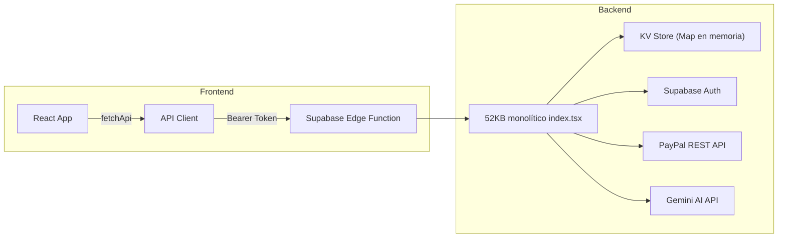
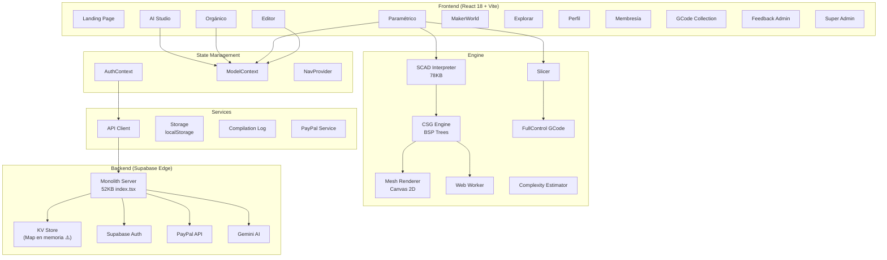

# 📋 Reporte de Salud, Integridad y Pendientes — Vorea Studio · Parametric 3D

**Fecha:** 12 de Marzo de 2026  
**Analista:** Antigravity AI  
**Proyecto:** [Vorea-Paramentrics-3D](file:///e:/__Vorea-Studio/__3D_parametrics/Vorea-Paramentrics-3D)  
**Origen:** Prototipo inicial migrado a entorno local y evolucionado como proyecto independiente  

> [!NOTE]
> Este reporte conserva observaciones históricas de una etapa anterior del proyecto. Desde marzo de 2026 el backend activo dejó de usar el árbol `supabase/functions/server/*`; cualquier mención a ese backend dentro de este documento debe leerse como contexto histórico de la auditoría original, no como arquitectura vigente.

---

## 1. Resumen Ejecutivo

| Indicador | Valor |
|---|---|
| **Salud general** | 🟡 **6.5 / 10** — funcional pero con deuda técnica significativa |
| **Funcionalidad core (SCAD engine)** | 🟢 **9/10** — Motor CSG + intérprete excepcional |
| **UI/UX** | 🟡 **6/10** — Dark mode premium pero con flujos desconectados |
| **Administración y roles** | 🟡 **5/10** — Estructura completa pero auth frágil |
| **Backend/Persistencia** | 🔴 **3/10** — Supabase Edge Functions, KV como "DB", sin deploy confirmado |
| **Testing** | 🔴 **0/10** — **CERO tests** en todo el proyecto |
| **Seguridad producción** | 🔴 **2/10** — Secrets expuestos, sin HTTPS/CORS real, auth mock como fallback |

---

## 2. Inventario del Proyecto

### 2.1 Estructura de Archivos

```
Vorea-Paramentrics-3D/
├── src/
│   ├── app/
│   │   ├── App.tsx                    (4.2 KB) — Root con ErrorBoundary/Suspense
│   │   ├── Root.tsx                   (14 KB)  — Header/Nav/Layout global
│   │   ├── nav.tsx                    (2.8 KB) — Sistema de navegación custom
│   │   ├── routes.tsx                 (146 B)  — Vacío (reliquia de react-router)
│   │   ├── pages/ ................ 12 páginas
│   │   ├── components/ ........... 48 UI + 10 feature + 1 legado
│   │   ├── engine/ ............... 8 módulos (motor 3D)
│   │   ├── services/ ............. 9 módulos (auth, API, storage)
│   │   └── models/ ............... 5 modelos SCAD built-in
│   ├── styles/ ................... 4 archivos CSS
│   └── imports/ .................. Logo SVG
├── supabase/functions/server/
│   ├── index.tsx              (52 KB) — Backend monolítico
│   └── kv_store.tsx           (2.8 KB) — "Base de datos" KV en Map
├── utils/supabase/            Credenciales Supabase
├── package.json               React 18, Vite 6, Tailwind 4
└── vite.config.ts             Aliases y exclusiones
```

### 2.2 Dependencias Clave

| Categoría | Paquetas | Estado |
|---|---|---|
| **UI Framework** | React 18.3.1 (peer) | ✅ |
| **Build** | Vite 6.3.5, Tailwind 4.1.12 | ✅ |
| **Componentes UI** | 20+ Radix UI primitives | ✅ Excesivo — muchos sin usar |
| **3D (no usados)** | three, @react-three/fiber, @react-three/drei | ⚠️ En [package.json](file:///e:/__Vorea-Studio/__3D_parametrics/Vorea-Paramentrics-3D/package.json) pero excluidos de bundling |
| **Animación** | framer-motion, motion, motion-dom, motion-utils | ⚠️ En [package.json](file:///e:/__Vorea-Studio/__3D_parametrics/Vorea-Paramentrics-3D/package.json) pero excluidos de bundling |
| **Router** | react-router 7.13.0 | ⚠️ En [package.json](file:///e:/__Vorea-Studio/__3D_parametrics/Vorea-Paramentrics-3D/package.json) pero no se usa (reemplazado por [nav.tsx](file:///e:/__Vorea-Studio/__3D_parametrics/Vorea-Paramentrics-3D/src/app/nav.tsx) custom) |
| **Auth** | @supabase/supabase-js 2.99.1 | ✅ |
| **Charts** | recharts 2.15.2 | ✅ Para panel admin |

> [!WARNING]
> Hay **~8 dependencias fantasma** que inflan el bundle sin usarse: `three`, `@react-three/*`, `framer-motion`, `motion*`, `react-router`, `@jscad/modeling`. Deben eliminarse de [package.json](file:///e:/__Vorea-Studio/__3D_parametrics/Vorea-Paramentrics-3D/package.json).

---

## 3. Análisis de Funcionalidades

### 3.1 Motor CSG & Intérprete SCAD — 🟢 Excelente

El motor es la **joya del proyecto**. 78 KB de intérprete SCAD con:

| Feature | Estado | Notas |
|---|---|---|
| Tokenizer (38 tipos) | ✅ | Notación científica, comentarios, keywords |
| Parser (18 tipos AST) | ✅ | List comprehensions, let(), ranges, member access |
| Primitivas 3D: cube, sphere, cylinder, polyhedron | ✅ | Completas |
| Primitivas 2D: polygon, circle, square, text | ✅ | text() con fuente segmentada real |
| Extrusiones: linear_extrude, rotate_extrude | ✅ | Con twist y segmentos |
| Transformaciones: translate, rotate, scale, mirror, resize, multmatrix | ✅ | |
| Booleanas: union, difference, intersection | ✅ | BSP Tree |
| Hull (Convex Hull 3D) | ✅ | Algoritmo incremental |
| Minkowski | ⚠️ | Aproximación vía hull |
| Módulos/funciones del usuario | ✅ | Con parámetros default, named args |
| 28+ funciones built-in | ✅ | Matemáticas, strings, vectoriales |
| Web Worker para compilación | ✅ | Con fallback al hilo principal |
| Estimador de complejidad | ✅ | Light/medium/heavy |

### 3.2 Páginas y Flujos de Usuario

````carousel
### Landing (`/`) — 🟢 Funcional
- Hero con gradiente, 4 feature cards
- 2 CTAs principales funcionan
- Navegación a herramientas

### Editor (`/editor`) — 🟡 Parcialmente funcional
- ✅ Editor de código SCAD integrado
- ✅ ScadViewport con motor CSG real
- ✅ ScadCustomizer auto-generado
- ✅ GCodePanel integrado
- ✅ Exportación STL/OBJ/SCAD funcional
- ⚠️ El flujo de guardar/cargar proyecto sigue limitado a `{radius, height, resolution}` en `ModelProject`

### Paramétrico (`/parametric`) — 🟢 Excelente
- ✅ 5 modelos SCAD built-in
- ✅ Carga de archivos .scad externos
- ✅ Escaneo de seguridad automático
- ✅ GCode panel con slicing y exportación
- ✅ Estimador de complejidad

### MakerWorld (`/makerworld`) — 🟡 Parcial
- ✅ Lint basado en geometría real del mesh
- ✅ Estadísticas calculadas del modelo real
- ✅ Exportación multi-formato funcional
- ⚠️ "Publicar a MakerWorld" no se conecta a API real
- ⚠️ Sin CTA claro si no hay modelo compilado

### AI Studio (`/ai-studio`) — 🟡 Simulado
- ✅ Genera código SCAD paramétrico por keywords (6 categorías)
- ✅ Botón "Abrir en Editor" transfiere código
- ⚠️ No se conecta a ninguna API de IA real (pattern matching local)
- ✅ Sistema de límites por tier funcional

### Orgánico (`/organic`) — 🟡 Parcial
- ✅ Genera código SCAD para Voronoi/Relieve/SVG Wrap
- ✅ Preview 2D visual
- ⚠️ No deforma modelos 3D reales
- ✅ Envía código al Editor

### Explorar/Comunidad (`/explore`) — 🔴 Mock
- 8 modelos hardcodeados con imágenes Unsplash
- Sin comunidad real, ni likes, ni uploads
- Tags filtrables pero sobre datos estáticos

### Perfil (`/profile`) — 🟡 Parcial
- ✅ Edición de nombre/username con localStorage
- ✅ Lista de modelos con editar/eliminar
- ⚠️ Stats basados en datos mock
- ⚠️ Sin avatar real (upload)
````

### 3.3 Sistema de Administración y Roles — 🟡 Estructurado pero Frágil

#### Modelo de Datos de Usuario

```typescript
type MembershipTier = "FREE" | "PRO" | "STUDIO PRO";
type UserRole = "user" | "admin" | "superadmin";

interface UserProfile {
  id: string;
  displayName: string;
  username: string;
  email: string;
  tier: MembershipTier;
  role?: UserRole;  // ⚠️ Optional — puede ser undefined
  avatarUrl?: string;
  createdAt: string;
  banned?: boolean;
  lastLoginAt?: string;
}
```

#### Panel SuperAdmin (`/admin`) — 62.8 KB

| Tab | Funcionalidad | Estado |
|---|---|---|
| **Dashboard** | KPIs resumen | ✅ Funcional con datos del backend |
| **Usuarios** | Buscar, editar tier/rol, banear, eliminar | ✅ |
| **Planes** | Editar precios, features, plan destacado | ✅ Persistido en KV |
| **Uso** | Gráfico registros 30 días, distribución tier | ✅ |
| **Finanzas** | Ingresos vs gastos, costos IA | ✅ |
| **Alertas** | Límites de gasto IA, presupuesto mensual | ✅ |
| **Emails** | Enviar a individuos/plan/todos | ⚠️ Mock (no envía emails reales) |
| **Logs** | Actividad reciente | ✅ |

#### Problemas del Sistema de Auth/Admin

> [!CAUTION]
> **Problemas críticos de seguridad y diseño:**

1. ~~**Doble sistema de auth conflictivo**~~ ✅ **Resuelto (BG-207)**
   [auth-context.tsx](src/app/services/auth-context.tsx) ya no posee un mock silencioso pasivo (local auth fue removido y el checkeo es estricto hacia base de datos).

2. ~~**SuperAdmin auto-promovible**~~ ✅ **Resuelto (BG-207)**
   El flag `promoteSuperAdmin()` y el endpoint de iniciación `/admin/init` fueron eliminados de UI y API. El rol admin desciende de forma autoritativa.

3. **Backend KV es volátil**  
   [kv_store.tsx](file:///e:/__Vorea-Studio/__3D_parametrics/Vorea-Paramentrics-3D/supabase/functions/server/kv_store.tsx) usa un `Map` en memoria. **Cada reinicio del edge function borra TODOS los datos**: usuarios, planes, alertas, logs.

4. **Token cache en módulo**  
   `_cachedAccessToken` es una variable de módulo — en SSR o testing podría filtrarse entre requests.

5. **No hay middleware de autorización centralizado**  
   Cada ruta del backend repite el patrón `getUserId()` + `isSuperAdmin()` sin middleware.

---

## 4. Backend — Análisis Detallado

### 4.1 Arquitectura



### 4.2 Rutas del Backend

| Grupo | Ruta | Método | Estado |
|---|---|---|---|
| **Auth** | `/auth/signup` | POST | ✅ |
| | `/auth/me` | GET/PUT | ✅ |
| **GCode** | `/gcode` | GET/POST | ✅ |
| | `/gcode/:id` | DELETE | ✅ |
| **Credits** | `/credits` | GET | ✅ |
| | `/credits/consume` | POST | ✅ |
| | `/credits/purchase` | POST | ✅ |
| **Feedback** | `/feedback` | GET/POST | ✅ |
| | `/feedback/ai-review` | POST | ✅ Gemini |
| | `/feedback/ai-stats` | GET | ✅ |
| | `/feedback/:id/status` | PUT | ✅ |
| **Admin** | `/admin/init` | POST | ✅ |
| | `/admin/reset-owner-password` | POST | ⚠️ Solo owner |
| | `/admin/users` | GET | ✅ |
| | `/admin/users/:id` | PUT/DELETE | ✅ |
| | `/admin/plans` | GET/PUT | ✅ |
| | `/admin/reports/usage` | GET | ✅ |
| | `/admin/reports/revenue` | GET | ✅ |
| | `/admin/alerts` | GET/PUT | ✅ |
| | `/admin/email` | POST | ⚠️ Mock (solo log) |
| | `/admin/logs` | GET | ✅ |
| **PayPal** | `/paypal/create-order` | POST | ✅ Sandbox |
| | `/paypal/capture-order` | POST | ✅ |

> [!IMPORTANT]
> **El KV Store es un `Map` en memoria.** No hay base de datos real. Cada cold start de la Edge Function pierde todos los datos. Para producción es necesario migrar a PostgreSQL (RLS de Supabase), MongoDB, o al menos Supabase Storage.

---

## 5. Testing y Calidad de Código

> [!CAUTION]
> **No existe NI UN SOLO test** en el proyecto. Ni unit tests, ni integration tests, ni e2e tests. No hay configuración de Jest, Vitest, Playwright, ni Cypress.

| Aspecto | Estado |
|---|---|
| Unit tests | ❌ 0 |
| Integration tests | ❌ 0 |
| E2E tests | ❌ 0 |
| TypeScript strict mode | ❌ No hay `tsconfig.json` visible |
| ESLint / Prettier | ❌ No configurados |
| CI/CD | ❌ No hay GitHub Actions / pipelines |
| Pre-commit hooks | ❌ No hay husky/lint-staged |

---

## 6. Navegación y Routing

El proyecto usa un **sistema de navegación custom** ([nav.tsx](file:///e:/__Vorea-Studio/__3D_parametrics/Vorea-Paramentrics-3D/src/app/nav.tsx)) que reemplaza `react-router` completamente:

- 12 rutas definidas como union type [PathName](file:///e:/__Vorea-Studio/__3D_parametrics/Vorea-Paramentrics-3D/src/app/nav.tsx#17-30)
- Navegación por estado React (`useState`)
- **Sin soporte de URL real**: No hay hash routing ni history API. Recargar la página siempre lleva a `/`
- **Sin soporte de deep linking**: No se puede compartir URLs
- **Sin 404 handling**: Rutas no reconocidas simplemente no renderizan nada

> [!WARNING]
> `react-router` sigue instalado en [package.json](file:///e:/__Vorea-Studio/__3D_parametrics/Vorea-Paramentrics-3D/package.json) (7.13.0) pero [routes.tsx](file:///e:/__Vorea-Studio/__3D_parametrics/Vorea-Paramentrics-3D/src/app/routes.tsx) está vacío. Es peso muerto: ~100KB de bundle innecesario.

---

## 7. Monetización — Estado Actual

| Feature | Implementación | Estado Producción |
|---|---|---|
| 3 tiers: FREE / PRO / STUDIO PRO | ✅ Frontend | ⚠️ Sin validación real |
| Upgrade de tier | ✅ [upgradeTier()](file:///e:/__Vorea-Studio/__3D_parametrics/Vorea-Paramentrics-3D/src/app/services/auth-context.tsx#48-49) | ⚠️ No cobra |
| PayPal checkout (credit packs) | ✅ Sandbox | ⚠️ Necesita llaves production |
| GCode credits (6 free + packs) | ✅ Completo | ⚠️ KV volátil |
| TierGate para features | ✅ Componente | ⚠️ Bypass posible en frontend |
| Feature gating real (Pro: GCode, deform, export STL) | Parcial | ⚠️ Sin validación backend |

---

## 8. Seguridad — Hallazgos

| Riesgo | Severidad | Descripción |
|---|---|---|
| Auth mock silenciosa | 🔴 Crítico | Si Supabase falla, cualquier email/password es válido |
| OWNER_EMAIL hardcodeado | 🟡 Medio | `vorea.studio3d@gmail.com` en código fuente |
| KV Store volátil | 🔴 Crítico | Datos se pierden en cada deploy/restart |
| Sin rate limiting | 🟡 Medio | Endpoints de feedback y AI review sin protección |
| PayPal en sandbox | 🟡 Esperado | Necesita migrar a producción |
| Secrets en Edge Functions | 🟡 Medio | Asumiendo configuración correcta en Supabase |
| Sin CORS configurado | 🟡 Medio | Edge Functions de Supabase manejan CORS nativamente |
| `navigator.locks` bypass | 🟢 Bajo | Workaround documentado y justificado |

---

## 9. Roadmap de Pendientes Priorizados

### 🔴 P0 — Críticos para producción

| # | Pendiente | Complejidad | Impacto |
|---|---|---|---|
| 1 | **Migrar KV Store a base de datos real** (PostgreSQL/MongoDB) | Alta | Los datos se pierden en cada restart |
| 2 | **Eliminar fallback mock de auth** — si Supabase falla, mostrar error, no autenticar | Media | Seguridad básica |
| 3 | **Agregar testing** — al menos unit tests del SCAD interpreter y servicios críticos | Alta | Calidad y mantenibilidad |
| 4 | **Configurar `tsconfig.json`** con strict mode | Baja | Prevención de bugs |
| 5 | **Eliminar dependencias fantasma** de [package.json](file:///e:/__Vorea-Studio/__3D_parametrics/Vorea-Paramentrics-3D/package.json) | Baja | -30% tamaño de `node_modules` |

### 🟡 P1 — Necesarios para MVP público

| # | Pendiente | Complejidad | Impacto |
|---|---|---|---|
| 6 | **Implementar URL routing real** (hash o history API) con deep linking | Media | UX fundamental |
| 7 | **Conectar AI Studio a API de IA real** (Gemini/OpenAI) para text-to-3D | Alta | Feature diferenciadora |
| 8 | **Sistema de comunidad real** — upload de modelos, likes, downloads con backend | Alta | Retención de usuarios |
| 9 | **Envío de emails real** — integrar Resend/SendGrid | Baja | Comunicación con usuarios |
| 10 | **Migrar PayPal a producción** + integrar suscripciones recurrentes | Media | Monetización |
| 11 | **ModelProject debe guardar SCAD source** — actualmente solo guarda `{radius, height, resolution}` | Media | Persistencia de proyectos |
| 12 | **Feature gating en backend** — validar tier en servidor, no solo en frontend | Media | Seguridad de monetización |

### 🟢 P2 — Mejoras de producto

| # | Pendiente | Complejidad | Impacto |
|---|---|---|---|
| 13 | **text() con fuente real** (actualmente fuente segmentada limitada) | Media | Calidad de renders |
| 14 | **Minkowski real** (actualmente aproximación via hull) | Alta | Precisión de geometría |
| 15 | **Deformaciones orgánicas en 3D real** (Orgánico solo genera SCAD template) | Alta | Feature de video del producto |
| 16 | **CI/CD pipeline** con GitHub Actions | Media | DevOps |
| 17 | **i18n completo** — el selector de idioma existe pero la traducción es parcial | Media | Mercado internacional |
| 18 | **Responsive/Mobile** — Layout existe pero paneles no se adaptan bien | Media | Mobile users |
| 19 | **Dashboard analytics real** para admin | Media | Business intelligence |
| 20 | **Rate limiting** en endpoints críticos | Baja | Seguridad |

---

## 10. Métricas del Código

| Métrica | Valor |
|---|---|
| **Total archivos fuente** | ~85 archivos .tsx/.ts/.css |
| **Archivo más grande** | [scad-interpreter.ts](file:///e:/__Vorea-Studio/__3D_parametrics/Vorea-Paramentrics-3D/src/app/engine/scad-interpreter.ts) — **78 KB** |
| **Página más grande** | [SuperAdmin.tsx](file:///e:/__Vorea-Studio/__3D_parametrics/Vorea-Paramentrics-3D/src/app/pages/SuperAdmin.tsx) — **62.8 KB** |
| **Backend monolítico** | [index.tsx](file:///e:/__Vorea-Studio/__3D_parametrics/Vorea-Paramentrics-3D/supabase/functions/server/index.tsx) — **52 KB** |
| **Componentes UI (Radix/Shadcn)** | 48 primitivos |
| **Componentes feature** | 10 (+1 legado) |
| **Modelos SCAD built-in** | 5 (Skadis Bin, Gridfinity, Cable Clip, Rounded Box, Phone Stand) |
| **Dependencias producción** | 42 paquetes |
| **Dependencias no usadas** | ~8 paquetes |
| **Líneas de código estimadas** | ~15,000+ |

---

## 11. Diagrama de Arquitectura de la App



---

## 12. Veredicto Final

**Vorea Studio Codex Parametric 3D** es un proyecto ambicioso que tiene un **motor CSG/SCAD excepcionalmente completo** para haber sido desarrollado en conversaciones con IA. El intérprete SCAD con 78KB de código soporta la mayoría de features de OpenSCAD y es la mayor fortaleza del proyecto.

Sin embargo, la deuda técnica es significativa:
- **El backend es efímero** (KV en memoria)
- **No hay tests** de ningún tipo
- **La autenticación tiene un agujero** con el fallback mock silencioso
- **8+ dependencias fantasma** inflan `node_modules`
- **El routing no soporta URLs reales**

**Recomendación:** Antes de cualquier desarrollo nuevo, invertir en los **P0** (base de datos real, eliminar auth mock, agregar tests básicos). Esto crearía una base sólida para construir las features restantes de manera confiable.
