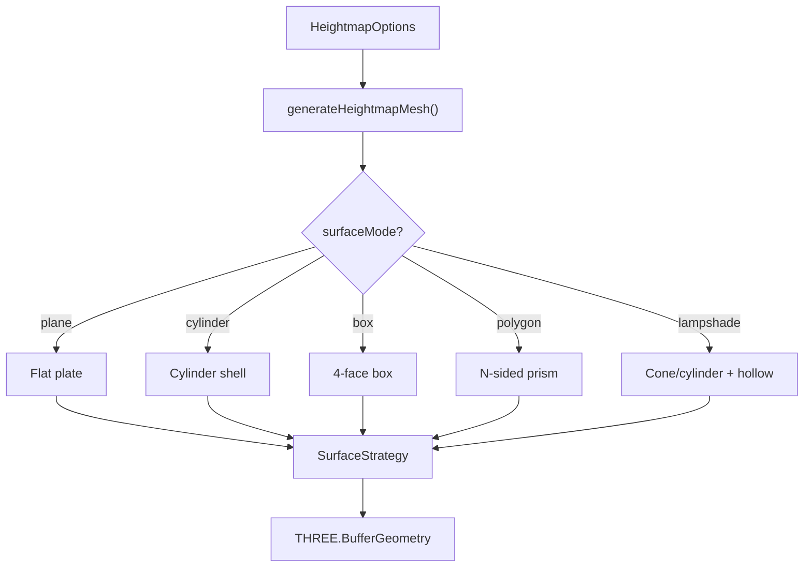

# Relief Surface Modes — Strategy Refactor Walkthrough

## Summary

Refactored the Relief engine to a **strategy pattern** with 5 surface modes, including a **cone-profile lampshade** with configurable hole radius for lighting diffusers.

## Files Changed (8 files, 4 commits on `feature/relief-surface-modes`)

### Engine — `src/app/engine/surface-modes/`

| File | Purpose |
|------|---------|
| [types.ts](file:///e:/__Vorea-Studio/__3D_parametrics/Vorea-Paramentrics-3D/src/app/engine/surface-modes/types.ts) | `SurfaceStrategy` interface + config types (updated with cone/hole radii) |
| [plane.ts](file:///e:/__Vorea-Studio/__3D_parametrics/Vorea-Paramentrics-3D/src/app/engine/surface-modes/plane.ts) | Flat plate (extracted from original) |
| [cylinder.ts](file:///e:/__Vorea-Studio/__3D_parametrics/Vorea-Paramentrics-3D/src/app/engine/surface-modes/cylinder.ts) | Cylindrical shell (extracted from original) |
| [box.ts](file:///e:/__Vorea-Studio/__3D_parametrics/Vorea-Paramentrics-3D/src/app/engine/surface-modes/box.ts) | **NEW** — 4-sided box with UV wrap + configurable caps |
| [polygon.ts](file:///e:/__Vorea-Studio/__3D_parametrics/Vorea-Paramentrics-3D/src/app/engine/surface-modes/polygon.ts) | **NEW** — N-sided prism (3–12 sides) |
| [lampshade.ts](file:///e:/__Vorea-Studio/__3D_parametrics/Vorea-Paramentrics-3D/src/app/engine/surface-modes/lampshade.ts) | **NEW** — Cone/cylinder with hollow interior, hole flanges |
| [index.ts](file:///e:/__Vorea-Studio/__3D_parametrics/Vorea-Paramentrics-3D/src/app/engine/surface-modes/index.ts) | Barrel export |

### Generator + UI

| File | Change |
|------|--------|
| [heightmap-generator.ts](file:///e:/__Vorea-Studio/__3D_parametrics/Vorea-Paramentrics-3D/src/app/engine/heightmap-generator.ts) | Strategy dispatch, new `HeightmapOptions` fields |
| [Relief.tsx](file:///e:/__Vorea-Studio/__3D_parametrics/Vorea-Paramentrics-3D/src/app/pages/Relief.tsx) | 5-button mode selector, per-mode parameter panels |

## Architecture

## Key Design Decisions

- **Lampshade cone profile**: `outerRadiusBottom` ≠ `outerRadiusTop` → cone shape via linear interpolation.
- **Flange-less Hole Radius**: Instead of building complex branching geometry for cap flanges, the inner wall smoothly interpolates between `holeRadius` (at capped ends) and `outerRadius - shellThickness` (at open ends). This creates a highly printable, smooth inner conical void.
- **Winding Order**: Corrected inward-facing normals and Y-axis top/bottom caps to ensure inner faces render correctly in Three.js and slicers.

## Validation

- `✓` Vite build passes
- `✓` 6 test files pass (vitest)
- `✓` Manifold geometry confirmed
